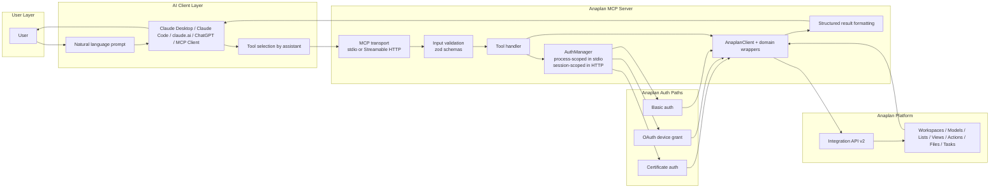
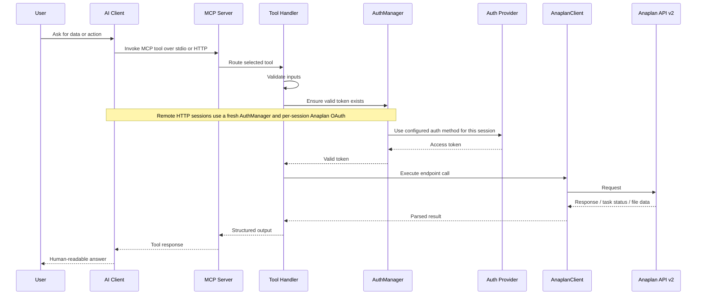
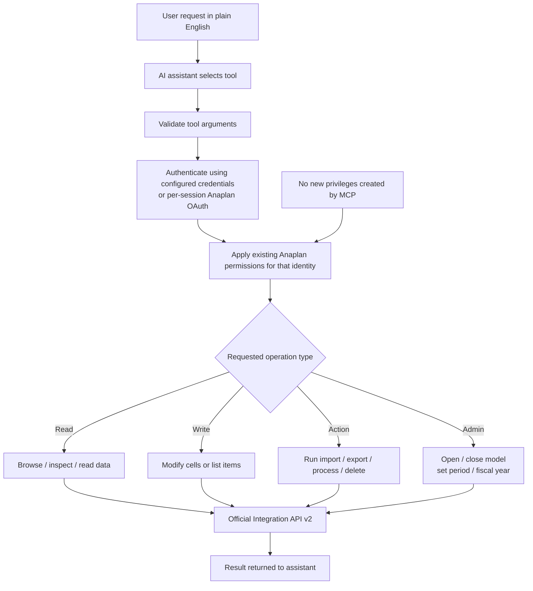

# Architecture Overview

Three views of how the Anaplan MCP server works at runtime.

---

## High-level runtime architecture

Shows the major subsystems and how data flows between them during a tool call.

---

## Request flow

Step-by-step sequence from user prompt to structured response.

---

## Trust and control boundary

How the server maps user intent to Anaplan permissions without adding any new privileges.

The server never creates new access rights. Every operation is bound by the permissions already attached to the Anaplan identity used for that session: the locally configured credentials in stdio mode, or the remote user's session-scoped OAuth identity in HTTP mode.
