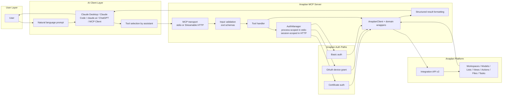
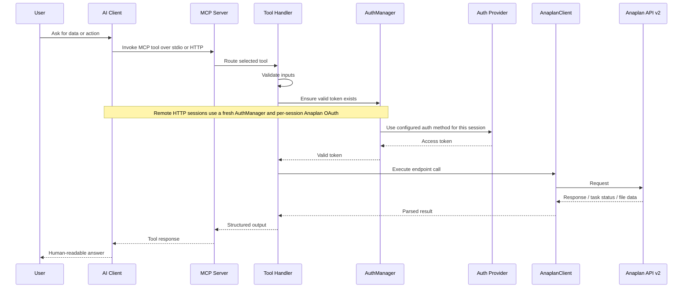
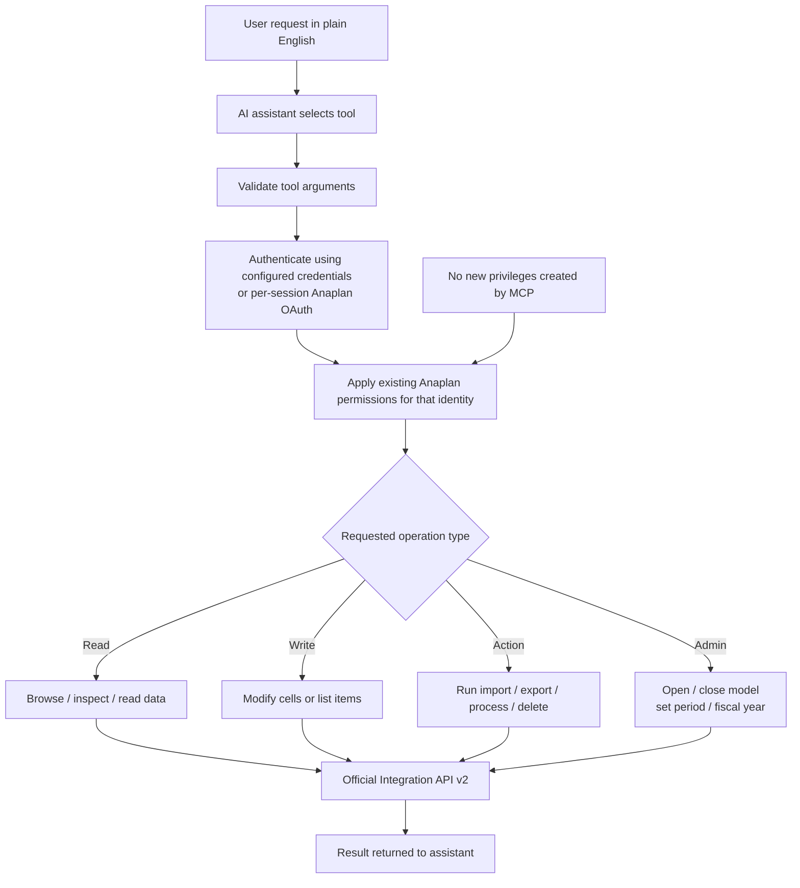

# Architecture Overview

Three views of how the Anaplan MCP server works at runtime.

## Anaplan modeling principles alignment

This document should be read alongside Anaplan's current modeling guidance:
- Your modeling experience: https://help.anaplan.com/your-modeling-experience-ee72bb4a-463f-44f7-bfb1-09892a951472
- Model building recommendations: https://help.anaplan.com/model-building-recommendations-6d742812-f1c7-4296-a504-651b1c8086f3
- Planual: https://support.anaplan.com/planual-5731dc37-317a-49fa-a5ff-7fc3926972de

Apply these principles when using the MCP tools against live models:

1. Start with the business case, not the API endpoint. Identify the planning process, decision points, facts, lists, time ranges, versions, and users before changing structures or data.
2. Follow DISCO module separation: Data, Input, System, Calculation, and Output modules should have clear responsibilities. Do not mix imports, assumptions, business logic, and reporting line items in one module unless the model owner has intentionally designed it that way.
3. Respect the Central Library. Lists, subsets, line item subsets, time, versions, users, roles, and naming conventions are shared model architecture, not disposable integration artefacts.
4. Prefer narrow dimensionality. Use only the dimensions required for a calculation or input. Use subsets, line-item applies-to, and time ranges to reduce cell count and improve performance.
5. Keep formulas simple, reusable, and auditable. Break complex logic into intermediate line items, use system modules for mappings and attributes, and avoid hard-coded item references where a lookup or mapping module is more maintainable.
6. Preserve model-builder intent. Before writing cells, adding list items, running imports, or changing calendar/version settings, inspect modules, line items, dimensions, saved views, actions, and task history so the operation follows the existing model design.
7. Use saved views and purpose-built import/export actions for integrations. Do not treat ad hoc grid reads/writes as a substitute for governed integration processes when a model already exposes actions or processes.
8. Validate before and after every write. Check source file mapping, dimensional coordinates, access permissions, model state, task result, rejected rows, and downstream output modules.
9. Protect ALM and production controls. Treat structural changes, list changes, current period, fiscal year, switchover, delete actions, and model open/close as governed operations that may affect production users.
10. Document assumptions. Record the model, workspace, module/view/action used, dimensional filters, version/time context, and any Planual trade-offs made during automation.
---

## High-level runtime architecture

Shows the major subsystems and how data flows between them during a tool call.

---

## Request flow

Step-by-step sequence from user prompt to structured response.

---

## Trust and control boundary

How the server maps user intent to Anaplan permissions without adding any new privileges.

The server never creates new access rights. Every operation is bound by the permissions already attached to the Anaplan identity used for that session: the locally configured credentials in stdio mode, or the remote user's session-scoped OAuth identity in HTTP mode.
