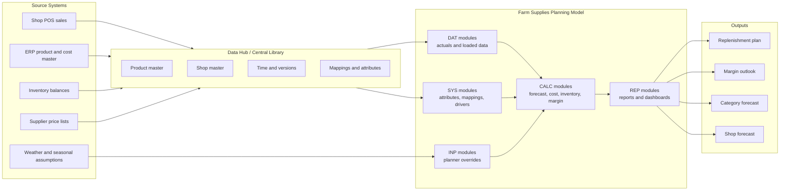
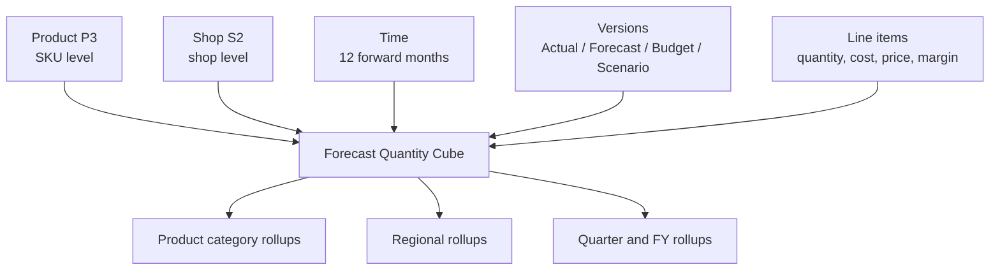
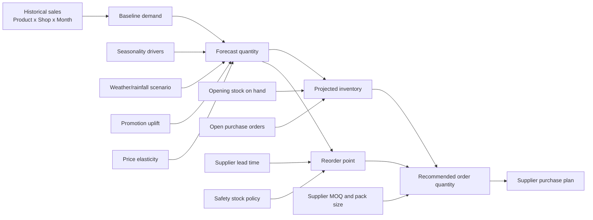

# Rural Retail Farm Supplies - Anaplan Solution Design

**Industry:** Rural retail / farm supplies
**Geography:** Australia
**Channel:** Physical shops selling to farmers and primary producers
**Planning horizon:** 12 forward-looking months
**Version:** 2.0
**Date:** April 28, 2026

---

## Anaplan modeling principles alignment

This solution design follows Anaplan Modeling Experience and Planual principles:

1. Start with the business process: shop-based sales planning, product demand forecasting, inventory cover, cost, and margin management.
2. Use DISCO separation: Data, Input, System, Calculation, and Output modules each have a single purpose.
3. Treat the Central Library as governed architecture: product, shop, region, supplier, version, and time lists are shared structures.
4. Use multi-dimensional cubes deliberately: products, shops, months, versions, and measures intersect only where needed.
5. Right-size dimensionality: use product category, region, and supplier mappings in system modules rather than over-dimensioning every calculation.
6. Keep formulas simple and auditable: break demand, cost, inventory, and margin logic into separate line items and modules.
7. Use saved views and import/export actions for integration rather than uncontrolled ad hoc grid loads.
8. Validate before and after writes: source mappings, dimensions, task results, rejected rows, and downstream reporting outputs.
9. Protect production controls: structural changes, current period, switchover, product hierarchy, and shop hierarchy changes should follow ALM governance.
10. Document assumptions, dimensionality, formulas, and known trade-offs.

---

## 1. Business scenario

The model supports an Australian rural retail company with a shop network that sells practical farm supplies to farmers. Product demand is seasonal and varies by region, rainfall, crop calendar, livestock activity, promotions, and supplier lead time.

The model answers these questions:

- What quantity of each product should each shop expect to sell over the next 12 months?
- What is the expected cost, revenue, gross margin, and gross margin percentage?
- Which products and shops need replenishment based on forecast demand and stock cover?
- Which categories are most exposed to cost inflation or margin compression?
- What purchasing quantities should be planned for suppliers and distribution centres?

Scope includes:

- Products
- Product categories
- Shops and regions
- Supplier lead times
- Standard costs and cost adjustments
- Forecast quantities for 12 forward-looking months
- Inventory cover and suggested replenishment
- Revenue, COGS, and gross margin

Company names are intentionally excluded so this design remains reusable and non-branded.

---

## 2. Product range inspiration

The product catalogue is inspired by typical Australian farm supply retailers. Categories include:

- Animal health and livestock handling
- Fertilisers and soil nutrition
- Crop protection and weed control
- Seed and pasture products
- Fencing, water, and general farm supplies
- PPE and shearing supplies
- Seasonal rural merchandise

This model is not a product safety, chemical compliance, or veterinary prescription system. It is a planning model for quantity, cost, inventory, and margin.

---

## 3. Solution architecture

---

## 4. Multi-dimensional cube design

Anaplan is a multi-dimensional calculation engine. This design uses dimensional cubes where the intersections are meaningful, then aggregates through product and shop hierarchies.

### Core planning cube

### Dimensional design principles

| Design area | Principle | Example |
|---|---|---|
| Product planning | Forecast at SKU level only where shops stock the product | P3 Product x S2 Shop x Month |
| Category reporting | Aggregate through hierarchy; do not duplicate category in forecast module | P1 Category parent of P2 Subcategory and P3 Product |
| Shop reporting | Aggregate through region hierarchy | S1 Region parent of S2 Shop |
| Supplier planning | Use mappings and summary modules, not supplier on every sales cube | SYS Product Details.Supplier |
| Costs | Cost is usually Product x Month, not Product x Shop x Month unless local freight differs | CALC Cost by Product.Month |
| Forecast overrides | Planners adjust only at useful intersections | Product x Shop x Month |
| Inventory | Stock is Product x Shop x Month | Inventory position by SKU and shop |

---

## 5. Central lists and hierarchies

### 5.1 Product hierarchy

| Level | List | Example items | Notes |
|---|---|---|---|
| P1 | Product Category | Fertiliser, Crop Protection, Animal Health, Fencing, Water, Seed, PPE | Reporting and margin targets |
| P2 | Product Subcategory | Nitrogen, Herbicide, Drench, Wire, Troughs, Pasture Seed | Category planning |
| P3 | Product SKU | Urea 46% 1t bulka bag, Glyphosate 450 20L, Cattle Drench 5L | Forecast and inventory planning |

### 5.2 Shop hierarchy

| Level | List | Example items | Notes |
|---|---|---|---|
| S1 | Region | Northern NSW, Riverina, Western VIC, Darling Downs, South West WA | Reporting and supply chain grouping |
| S2 | Shop | Regional shop 001, Regional shop 002, Regional shop 003 | Forecast and inventory planning |

### 5.3 Other lists

| List | Purpose | Example items |
|---|---|---|
| Supplier | Supplier grouping for purchasing | Supplier A, Supplier B, Supplier C |
| Channel | Sales channel | Shop Counter, Account Order, Click and Collect |
| Forecast Driver | Driver type | Baseline, Seasonality, Weather, Promotion, Price Elasticity |
| Cost Type | Cost decomposition | Base Cost, Freight, Handling, Supplier Rebate, Cost Inflation |
| Unit of Measure | Product planning unit | Each, 5L drum, 20L drum, 25kg bag, 1t bag, roll, metre |
| Versions | Planning scenarios | Actual, Forecast, Budget, Upside, Downside |
| Time | 12 forward months | Jul 26 to Jun 27 in this example |

---

## 6. Sample product catalogue

Realistic, non-branded products are used. Costs are illustrative AUD standard costs and should be loaded from the ERP or supplier price list in production.

| Product Code | Product SKU | Category | Subcategory | UOM | Standard Cost AUD | Standard Price AUD | Supplier Lead Time Days | Seasonality |
|---|---|---|---|---:|---:|---:|---:|---|
| FERT-UREA-1T | Urea 46% nitrogen bulka bag | Fertiliser | Nitrogen | 1t bag | 785.00 | 890.00 | 21 | Winter/Spring |
| FERT-DAP-1T | DAP fertiliser bulka bag | Fertiliser | Phosphorus | 1t bag | 910.00 | 1,035.00 | 28 | Autumn/Winter |
| FERT-LIME-25KG | Agricultural lime granules | Fertiliser | Soil amendment | 25kg bag | 13.20 | 19.50 | 14 | Autumn |
| CHEM-GLY-20L | Glyphosate 450 herbicide | Crop Protection | Herbicide | 20L drum | 118.00 | 169.00 | 18 | Autumn/Spring |
| CHEM-FUNG-10L | Broadacre fungicide 10L | Crop Protection | Fungicide | 10L drum | 244.00 | 319.00 | 24 | Winter/Spring |
| CHEM-INSEC-5L | Insecticide concentrate 5L | Crop Protection | Insecticide | 5L drum | 138.00 | 199.00 | 21 | Spring/Summer |
| SEED-RYE-25KG | Annual ryegrass seed | Seed | Pasture seed | 25kg bag | 78.00 | 112.00 | 30 | Autumn |
| SEED-CLOVER-25KG | Sub-clover seed | Seed | Pasture seed | 25kg bag | 132.00 | 178.00 | 35 | Autumn |
| AH-DRENCH-5L | Cattle oral drench | Animal Health | Drench | 5L drum | 86.00 | 129.00 | 14 | Winter/Spring |
| AH-VACC-500ML | Livestock vaccine 500mL | Animal Health | Vaccine | each | 64.00 | 96.00 | 10 | Autumn/Winter |
| FENCE-WIRE-500M | High tensile fencing wire | Fencing | Wire | 500m roll | 96.00 | 145.00 | 21 | Year-round |
| FENCE-POST-100 | Steel fence posts bundle | Fencing | Posts | 100 pack | 385.00 | 530.00 | 28 | Year-round |
| WATER-TROUGH-600L | Poly livestock trough 600L | Water | Troughs | each | 310.00 | 465.00 | 21 | Summer |
| WATER-PUMP-2IN | Transfer pump 2 inch | Water | Pumps | each | 275.00 | 399.00 | 28 | Summer |
| PPE-GLOVE-12PK | Nitrile chemical gloves 12 pack | PPE | Safety | pack | 18.00 | 32.00 | 7 | Year-round |
| SHEAR-COMB-SET | Shearing comb and cutter set | Shearing | Consumables | set | 42.00 | 68.00 | 14 | Spring |

---

## 7. 12-month forecast quantity example

The production model forecasts at Product x Shop x Month x Version. The table below shows a sample national category-level rollup for the Forecast version.

### Forecast Quantity by Category

| Category | Jul 26 | Aug 26 | Sep 26 | Oct 26 | Nov 26 | Dec 26 | Jan 27 | Feb 27 | Mar 27 | Apr 27 | May 27 | Jun 27 | 12M Total |
|---|---:|---:|---:|---:|---:|---:|---:|---:|---:|---:|---:|---:|---:|
| Fertiliser | 1,020 | 1,180 | 1,430 | 1,650 | 1,280 | 760 | 620 | 700 | 1,050 | 1,520 | 1,690 | 1,440 | 14,340 |
| Crop Protection | 820 | 980 | 1,240 | 1,510 | 1,430 | 1,120 | 940 | 880 | 1,060 | 1,340 | 1,470 | 1,210 | 14,000 |
| Seed | 540 | 620 | 680 | 410 | 280 | 180 | 160 | 210 | 740 | 1,320 | 1,140 | 720 | 7,000 |
| Animal Health | 760 | 830 | 920 | 1,050 | 1,180 | 1,240 | 1,160 | 1,050 | 930 | 880 | 840 | 790 | 11,630 |
| Fencing | 420 | 450 | 500 | 540 | 560 | 520 | 480 | 470 | 500 | 530 | 560 | 540 | 6,070 |
| Water | 180 | 210 | 260 | 340 | 450 | 560 | 610 | 540 | 390 | 280 | 230 | 200 | 4,250 |
| PPE and Shearing | 390 | 420 | 650 | 820 | 760 | 510 | 360 | 330 | 360 | 400 | 420 | 430 | 5,850 |
| **Total units** | **4,130** | **4,690** | **5,680** | **6,320** | **5,940** | **4,890** | **4,330** | **4,180** | **5,030** | **6,270** | **6,350** | **5,330** | **63,140** |

### Forecast Value and Gross Margin Summary

| Category | 12M Qty | Avg Price AUD | Forecast Revenue AUD | Forecast COGS AUD | Gross Margin AUD | GM % |
|---|---:|---:|---:|---:|---:|---:|
| Fertiliser | 14,340 | 498 | 7,141,320 | 6,094,000 | 1,047,320 | 14.7% |
| Crop Protection | 14,000 | 229 | 3,206,000 | 2,422,000 | 784,000 | 24.5% |
| Seed | 7,000 | 145 | 1,015,000 | 735,000 | 280,000 | 27.6% |
| Animal Health | 11,630 | 113 | 1,314,190 | 883,880 | 430,310 | 32.7% |
| Fencing | 6,070 | 338 | 2,051,660 | 1,476,020 | 575,640 | 28.1% |
| Water | 4,250 | 432 | 1,836,000 | 1,278,000 | 558,000 | 30.4% |
| PPE and Shearing | 5,850 | 50 | 292,500 | 193,050 | 99,450 | 34.0% |
| **Total** | **63,140** |  | **16,856,670** | **13,081,950** | **3,774,720** | **22.4%** |

---

## 8. Supply-chain planning logic

Typical rural retail supply-chain planning needs to connect demand, stock, supplier lead time, and order quantities. The model should support both shop-level replenishment and supplier/category purchasing views.

### Replenishment policies

| Policy | Use case | Logic |
|---|---|---|
| Min/max cover | Stable general merchandise | Keep stock between minimum and maximum days of cover |
| Seasonal prebuild | Fertiliser, seed, chemical peaks | Build stock before peak selling windows |
| Make-to-order / special order | Expensive equipment or slow-moving rural merchandise | Do not hold stock unless demand is confirmed |
| Safety stock | Critical animal health and water products | Maintain buffer based on lead time and service level |
| MOQ rounding | Supplier or freight constraints | Round recommended order to pack, pallet, or truck quantity |

---

## 9. DISCO module design

### 9.1 Data modules

| Module | Purpose | Applies To | Time | Versions | Notes |
|---|---|---|---|---|---|
| DAT01 Sales History | Loaded actual POS/account sales quantities and revenue | P3 Product, S2 Shop | Month | Actual | Source for baseline demand |
| DAT02 Inventory Snapshot | Opening stock on hand and stock on order | P3 Product, S2 Shop | Month | Actual | Monthly snapshot or current period import |
| DAT03 Product Cost | Standard cost and supplier list cost | P3 Product | Month | Actual, Forecast | Loaded from ERP/supplier files |
| DAT04 Product Master | Product attributes | P3 Product | Not Applicable | Not Applicable | Code, UOM, category, supplier |
| DAT05 Shop Master | Shop attributes | S2 Shop | Not Applicable | Not Applicable | Region, climate zone, distribution route |

### 9.2 System modules

| Module | Purpose | Applies To | Key line items |
|---|---|---|---|
| SYS01 Time Settings | Forward-month flags and season flags | Time | Current Period?, Forecast Month?, Month Number, Season |
| SYS02 Product Details | Product mappings and attributes | P3 Product | Category, Subcategory, Supplier, UOM, Shelf Life, Stocked? |
| SYS03 Shop Details | Shop mappings and attributes | S2 Shop | Region, Climate Zone, DC Route, Active? |
| SYS04 Product Supply Policy | Replenishment parameters | P3 Product | Lead Time Days, Safety Stock Days, MOQ, Pack Size, Stocking Policy |
| SYS05 Category Margin Targets | Target margin and discount guardrails | P1 Product Category | Target GM %, Floor GM %, Max Discount % |
| SYS06 Seasonality Drivers | Category seasonal profiles | P1 Product Category | Time | Seasonal Index |

### 9.3 Input modules

| Module | Purpose | Applies To | Time | Versions | Planner |
|---|---|---|---|---|---|
| INP01 Baseline Override | Planner quantity override | P3 Product, S2 Shop | Month | Forecast, Budget | Demand planner / shop manager |
| INP02 Demand Drivers | Weather, promotion, and local event adjustments | P1 Product Category, S1 Region | Month | Forecast, Scenario | Category manager |
| INP03 Price and Cost Assumptions | Planned price and cost changes | P3 Product | Month | Forecast, Budget | Finance/category manager |
| INP04 Inventory Policy Override | Shop-specific safety stock overrides | P3 Product, S2 Shop | Month | Forecast | Supply planner |

### 9.4 Calculation modules

| Module | Purpose | Applies To | Time | Versions |
|---|---|---|---|---|
| CALC01 Demand Forecast | Forecast quantities by SKU and shop | P3 Product, S2 Shop | Month | Forecast, Budget, Scenario |
| CALC02 Cost and Price | Unit cost, landed cost, sell price | P3 Product | Month | Forecast, Budget, Scenario |
| CALC03 Revenue and Margin | Revenue, COGS, gross margin | P3 Product, S2 Shop | Month | Forecast, Budget, Scenario |
| CALC04 Inventory Projection | Projected stock, cover, reorder point | P3 Product, S2 Shop | Month | Forecast, Budget, Scenario |
| CALC05 Supplier Purchase Plan | Recommended order by supplier | P3 Product, Supplier | Month | Forecast, Budget, Scenario |

### 9.5 Reporting modules

| Module | Purpose | Applies To | Time | Versions |
|---|---|---|---|---|
| REP01 Category Forecast | Category quantity, revenue, margin | P1 Product Category, S1 Region | Month | Forecast, Budget, Scenario |
| REP02 Shop Forecast | Shop-level sales and margin | S2 Shop | Month | Forecast, Budget, Scenario |
| REP03 Replenishment Exceptions | Products below target cover | P3 Product, S2 Shop | Month | Forecast |
| REP04 Supplier Buy Plan | Purchase quantities and cost by supplier | Supplier | Month | Forecast, Budget, Scenario |
| REP05 Executive Summary | National totals and KPIs | Not Applicable | Month, Quarter, Year | Forecast, Budget, Scenario |

---

## 10. Detailed line items and formulas

Formula syntax is Anaplan-style and may need minor adaptation to exact model names. Line items are split to keep formulas readable and Planual-aligned.

### 10.1 SYS01 Time Settings

Applies To: Time only

| Line Item | Format | Summary | Formula / Input |
|---|---|---|---|
| Current Period? | Boolean | Any | `ITEM(Time) = CURRENTPERIODSTART()` equivalent model setting flag |
| Forecast Month? | Boolean | Any | `START() > CURRENTPERIODSTART()` |
| Forward Month Number | Number | None | Sequential number 1 to 12 for forecast window |
| Season | List: Season | None | Manual mapping or calendar lookup |
| Days in Month | Number | None | `DAYS()` |
| Quarter Label | Text | None | Used for reporting only |

### 10.2 SYS02 Product Details

Applies To: P3 Product

| Line Item | Format | Summary | Formula / Input |
|---|---|---|---|
| Product Code | Text | None | `CODE(ITEM('P3 Product'))` |
| Category | List: P1 Product Category | None | Loaded mapping |
| Subcategory | List: P2 Product Subcategory | None | `PARENT(ITEM('P3 Product'))` where hierarchy supports it |
| Supplier | List: Supplier | None | Loaded mapping |
| UOM | List: Unit of Measure | None | Loaded mapping |
| Stocked Product? | Boolean | Any | Loaded flag |
| Slow Moving? | Boolean | Any | Loaded or calculated from sales history |
| Shelf Life Months | Number | None | Loaded attribute |

### 10.3 SYS04 Product Supply Policy

Applies To: P3 Product

| Line Item | Format | Summary | Formula / Input |
|---|---|---|---|
| Lead Time Days | Number | None | Loaded by product/supplier |
| Safety Stock Days | Number | None | Input by category or SKU |
| Minimum Order Qty | Number | None | Loaded by supplier terms |
| Pack Size | Number | None | Loaded by UOM/pack configuration |
| Target Cover Days | Number | None | Input policy |
| Seasonal Prebuild? | Boolean | Any | True for fertiliser, seed, selected crop protection |

### 10.4 INP02 Demand Drivers

Applies To: P1 Product Category, S1 Region, Time, Versions

| Line Item | Format | Summary | Formula / Input |
|---|---|---|---|
| Weather Impact % | Percentage | None | Planner input, e.g. rainfall/drought effect |
| Promotion Uplift % | Percentage | None | Planner input |
| Local Event Uplift % | Percentage | None | Planner input |
| Price Elasticity Impact % | Percentage | None | Planner input or calculated |
| Demand Driver % | Percentage | None | `Weather Impact % + Promotion Uplift % + Local Event Uplift % + Price Elasticity Impact %` |

### 10.5 CALC01 Demand Forecast

Applies To: P3 Product, S2 Shop, Time, Versions

| Line Item | Format | Summary | Formula |
|---|---|---|---|
| Historical Qty | Number | Sum | `DAT01 Sales History.Quantity` |
| Prior Year Qty | Number | Sum | `OFFSET(Historical Qty, -12, 0)` |
| Three Month Avg Qty | Number | Sum | `MOVINGSUM(Historical Qty, -3, -1) / 3` |
| Category | List: P1 Product Category | None | `SYS02 Product Details.Category` |
| Region | List: S1 Region | None | `SYS03 Shop Details.Region` |
| Seasonal Index | Number | None | `SYS06 Seasonality Drivers.Seasonal Index[LOOKUP: Category]` |
| Demand Driver % | Percentage | None | `INP02 Demand Drivers.Demand Driver %[LOOKUP: Category, LOOKUP: Region]` |
| Statistical Forecast Qty | Number | Sum | `MAX(0, Three Month Avg Qty * Seasonal Index * (1 + Demand Driver %))` |
| Planner Override Qty | Number | Sum | `INP01 Baseline Override.Override Qty` |
| Override? | Boolean | Any | `INP01 Baseline Override.Override?` |
| Final Forecast Qty | Number | Sum | `IF Override? THEN Planner Override Qty ELSE Statistical Forecast Qty` |
| Forecast Qty Rounded | Number | Sum | `ROUND(Final Forecast Qty, 0, UP)` |

### 10.6 CALC02 Cost and Price

Applies To: P3 Product, Time, Versions

| Line Item | Format | Summary | Formula |
|---|---|---|---|
| Base Unit Cost | Currency | None | `DAT03 Product Cost.Standard Cost` |
| Supplier Cost Inflation % | Percentage | None | `INP03 Price and Cost Assumptions.Cost Inflation %` |
| Freight Cost per Unit | Currency | None | `INP03 Price and Cost Assumptions.Freight Cost per Unit` |
| Handling Cost per Unit | Currency | None | `INP03 Price and Cost Assumptions.Handling Cost per Unit` |
| Supplier Rebate % | Percentage | None | `INP03 Price and Cost Assumptions.Supplier Rebate %` |
| Inflated Unit Cost | Currency | None | `Base Unit Cost * (1 + Supplier Cost Inflation %)` |
| Landed Unit Cost | Currency | None | `Inflated Unit Cost + Freight Cost per Unit + Handling Cost per Unit` |
| Net Unit Cost | Currency | None | `Landed Unit Cost * (1 - Supplier Rebate %)` |
| List Sell Price | Currency | None | `INP03 Price and Cost Assumptions.List Sell Price` |
| Planned Discount % | Percentage | None | `INP03 Price and Cost Assumptions.Planned Discount %` |
| Net Sell Price | Currency | None | `List Sell Price * (1 - Planned Discount %)` |

### 10.7 CALC03 Revenue and Margin

Applies To: P3 Product, S2 Shop, Time, Versions

| Line Item | Format | Summary | Formula |
|---|---|---|---|
| Forecast Qty | Number | Sum | `CALC01 Demand Forecast.Forecast Qty Rounded` |
| Net Sell Price | Currency | None | `CALC02 Cost and Price.Net Sell Price` |
| Net Unit Cost | Currency | None | `CALC02 Cost and Price.Net Unit Cost` |
| Revenue | Currency | Sum | `Forecast Qty * Net Sell Price` |
| COGS | Currency | Sum | `Forecast Qty * Net Unit Cost` |
| Gross Margin | Currency | Sum | `Revenue - COGS` |
| Gross Margin % | Percentage | None | `DIVIDE(Gross Margin, Revenue)` |
| Target GM % | Percentage | None | `SYS05 Category Margin Targets.Target GM %[LOOKUP: SYS02 Product Details.Category]` |
| GM Below Target? | Boolean | Any | `Gross Margin % < Target GM %` |
| Margin Gap | Currency | Sum | `(Target GM % * Revenue) - Gross Margin` |

### 10.8 CALC04 Inventory Projection

Applies To: P3 Product, S2 Shop, Time, Versions

| Line Item | Format | Summary | Formula |
|---|---|---|---|
| Opening Stock | Number | Sum | `IF SYS01 Time Settings.Forward Month Number = 1 THEN DAT02 Inventory Snapshot.Stock On Hand ELSE PREVIOUS(Closing Stock)` |
| Forecast Demand Qty | Number | Sum | `CALC01 Demand Forecast.Forecast Qty Rounded` |
| Open Purchase Orders | Number | Sum | `DAT02 Inventory Snapshot.Stock On Order` |
| Recommended Order Qty | Number | Sum | Calculated below |
| Available Supply | Number | Sum | `Opening Stock + Open Purchase Orders + Recommended Order Qty` |
| Closing Stock | Number | Sum | `MAX(0, Available Supply - Forecast Demand Qty)` |
| Average Daily Demand | Number | None | `DIVIDE(Forecast Demand Qty, SYS01 Time Settings.Days in Month)` |
| Lead Time Demand | Number | Sum | `Average Daily Demand * SYS04 Product Supply Policy.Lead Time Days` |
| Safety Stock Qty | Number | Sum | `Average Daily Demand * SYS04 Product Supply Policy.Safety Stock Days` |
| Reorder Point | Number | Sum | `Lead Time Demand + Safety Stock Qty` |
| Days Cover | Number | None | `DIVIDE(Closing Stock, Average Daily Demand)` |
| Below Reorder Point? | Boolean | Any | `Closing Stock < Reorder Point` |
| Raw Order Qty | Number | Sum | `MAX(0, Reorder Point + Forecast Demand Qty - Opening Stock - Open Purchase Orders)` |
| MOQ Adjusted Qty | Number | Sum | `MAX(Raw Order Qty, SYS04 Product Supply Policy.Minimum Order Qty)` |
| Pack Rounded Qty | Number | Sum | `ROUND(MOQ Adjusted Qty / SYS04 Product Supply Policy.Pack Size, 0, UP) * SYS04 Product Supply Policy.Pack Size` |
| Recommended Order Qty Final | Number | Sum | `IF Below Reorder Point? THEN Pack Rounded Qty ELSE 0` |

Note: In the build, avoid circular references by placing Recommended Order Qty Final in a separate module or using a monthly process step if projected inventory and order recommendations need to iterate.

### 10.9 CALC05 Supplier Purchase Plan

Applies To: P3 Product, Supplier, Time, Versions

| Line Item | Format | Summary | Formula |
|---|---|---|---|
| Product Supplier | List: Supplier | None | `SYS02 Product Details.Supplier` |
| Recommended Shop Order Qty | Number | Sum | `CALC04 Inventory Projection.Recommended Order Qty Final` |
| Supplier Order Qty | Number | Sum | `Recommended Shop Order Qty[SUM: Product Supplier]` |
| Unit Cost | Currency | None | `CALC02 Cost and Price.Net Unit Cost` |
| Purchase Value | Currency | Sum | `Supplier Order Qty * Unit Cost` |
| Lead Time Days | Number | None | `SYS04 Product Supply Policy.Lead Time Days` |
| Arrival Month | Time Period: Month | None | Month shifted by lead time, modelled via mapping if required |

---

## 11. User experience pages

| Page | Audience | Purpose | Key grids / cards |
|---|---|---|---|
| Executive Overview | Leadership | National sales, margin, and inventory risk | Revenue, GM %, category trend, exception count |
| Category Manager Workspace | Category managers | Manage product assumptions and review category forecast | Product price/cost inputs, forecast by category, margin exceptions |
| Shop Forecast Review | Shop managers | Review and override local demand | Product x month quantity grid, driver comments, override flags |
| Replenishment Planner | Supply planners | Generate recommended order quantities | Below reorder point list, supplier buy plan, days cover |
| Finance Review | Finance | Validate revenue, COGS, and margin outlook | Category P&L, margin bridge, cost inflation impact |

---

## 12. Integration design

### Inbound data

| Source | Data | Frequency | Target module | Notes |
|---|---|---|---|---|
| POS / sales system | Sales quantity, revenue, shop, product, date | Daily or monthly | DAT01 Sales History | Monthly aggregation recommended for planning model |
| ERP product master | SKU, UOM, category, supplier | Daily or on change | DAT04 Product Master | Central Library controlled |
| ERP cost file | Standard cost, supplier cost, rebate | Monthly or on change | DAT03 Product Cost | Versioned for forecast assumptions |
| Inventory system | Stock on hand, stock on order | Daily or weekly | DAT02 Inventory Snapshot | Use latest snapshot for opening stock |
| External assumptions | Rainfall outlook, seasonal index, local events | Monthly | INP02 Demand Drivers | Optional; can be planner input |

### Outbound data

| Output | Consumer | Frequency | Source module |
|---|---|---|---|
| Supplier purchase plan | Procurement / ERP | Weekly or monthly | REP04 Supplier Buy Plan |
| Category forecast | Category management | Monthly | REP01 Category Forecast |
| Shop demand plan | Operations | Monthly | REP02 Shop Forecast |
| Margin outlook | Finance | Monthly | REP05 Executive Summary |

---

## 13. Model build sequence

| Phase | Duration | Deliverables |
|---|---:|---|
| 1. Foundation | 1 week | Product, shop, supplier, time, and version lists; SYS modules |
| 2. Data load | 1 week | Sales history, product master, costs, and inventory imports |
| 3. Forecast engine | 2 weeks | Baseline demand, seasonality, drivers, forecast override process |
| 4. Cost and margin | 1 week | Landed cost, sell price, COGS, gross margin calculations |
| 5. Inventory and replenishment | 2 weeks | Stock projection, reorder point, MOQ/pack rounding, supplier buy plan |
| 6. UX and reporting | 1 week | Executive, category, shop, replenishment, and finance pages |
| 7. Testing and deployment | 1 week | UAT, reconciliation, ALM deployment, runbook |
| **Total** | **9 weeks** | Production-ready planning model |

---

## 14. Validation and test cases

| Test | Expected result |
|---|---|
| Product hierarchy rollup | SKU forecast quantities aggregate to subcategory and category totals |
| Shop hierarchy rollup | Shop forecast aggregates to region and national totals |
| Forecast override | If Override? is true, Final Forecast Qty equals Planner Override Qty |
| Negative demand prevention | Final forecast quantity cannot be below zero |
| Margin calculation | Revenue minus COGS equals Gross Margin |
| GM target flag | GM Below Target? is true when GM % is below category target |
| Inventory projection | Closing Stock equals Opening Stock + Open PO + Recommended Order - Forecast Demand |
| Reorder trigger | Below Reorder Point? is true when Closing Stock is below policy threshold |
| MOQ and pack rounding | Recommended order respects supplier minimum and pack size |
| Version isolation | Forecast, Budget, Upside, and Downside values are independently reviewable |

---

## 15. Key implementation notes

- Use product and shop hierarchies for aggregation; avoid duplicate category or region dimensions in detailed forecast modules.
- Keep Product x Shop x Month modules focused on quantity and inventory. Product-only modules should hold cost and price where shop variation is not required.
- Use SYS modules for mappings and attributes. Do not hard-code category or supplier names in formulas.
- Use line item subsets only where a reporting or calculation pattern genuinely needs them.
- Use saved views for imports and exports, with stable codes for products, shops, suppliers, and time periods.
- Apply selective access for shop managers so they only edit relevant shops.
- Keep actuals locked and write planner inputs only to forecast/scenario versions.
- For production ALM, classify assumptions and transactional data as production data where appropriate.

---

## 16. Related repository documents

- `Anaplan_Modelling.md` - General modelling and DISCO guidance
- `Anaplan_API_Guide.md` - Integration API patterns
- `docs/guides/anaplan-tool-guide.md` - MCP tool usage patterns
